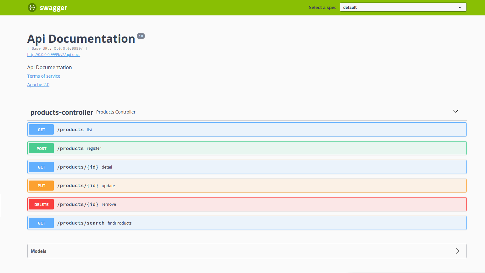

# catalogo_de_produtos

Catálogo de produtos desenvolvido com Java e Spring Boot (API Rest).

Neste microserviço é possível criar, alterar, visualizar e excluir um determinado produto, além de visualizar a lista de produtos atuais disponíveis e realizar a busca de produtos filtrando por `name`, `description` e `price`.

O formato esperado de um produto é representado pelo seguinte JSON:

```json
{
    "id": "string",
    "name": "string",
    "description": "string",
    "price": 99.99
}
```

### Endpoints

Estão disponíveis os seguintes endpoints para operação do catálogo de produtos:

|   **Verbo HTTP**   |  **Resource path**  |    **Descrição**            |
| :---               | :---                | :---                        |
| POST               | /products           | Criação de um produto       |
| PUT	             | /products/{id}      | Atualização de um produto   |
| GET                | /products/{id}      | Busca de um produto por ID  |
| GET	             | /products           | Lista de produtos           |
| GET                | /products/search    | Lista de produtos filtrados |
| DELETE	         | /products/{id}      | Deleção de um produto       |

**POST /products**

Esse endpoint cria um novo produto na base de dados, ao receber o JSON do produto, será validado e persistido na base de dados e retornado com o id gerado e HTTP 201.

Em caso de algum erro de validação, a API retornar um HTTP 400 indicando uma requisição inválida. O JSON retornado nesse caso segue o seguinte formato:

```json
{
"status_code": integer,
"message": "string"
}
```

**PUT /products/{id}**

Esse endpoint atualiza um produto baseado no {id} passado via path param. Antes de alterar, será consultado na base de dados pelo id, se o produto não for localizado, será devolvedo um HTTP 404 ao cliente. Se localizar o produto, então os campos `name`, `description` e `price` serão atualizados conforme recebidos no body da requisição.

**GET /products/{id}**

Esse endpoint retornará o product localizado na base de dados com um HTTP 200. Em caso de não localização do produto, a API retornará um HTTP 404 indicando que o recurso não foi localizado.

**GET /products**

Nesse endpoint a API retornará uma lista atual de todos os produtos com HTTP 200. Se não existir produtos, retornar uma lista vazia.

**GET /products/search**

Nesse endpoint a API retornará uma lista atual de todos os produtos filtrados de acordo com query parameters passados na URL.

Os query parameters aceitos são: `q`, `min_price` e `max_price`.

Observção: nenhum deles á obrigatório na requisição.

Onde:

|   **Query param**   |  **Ação de filtro**                                  |
| :---                | :---                                                 |
| q                   | bate o valor contra os campos `name` e `description` |
| min_price	          | bate o valor `>=` contra o campo `price`             |
| max_price           | bate o valor `<=` contra o campo `price`             |

Exemplo: /products/search?min_price=10.5&max_price=50&q=superget

**DELETE /products/{id}**

Esse endpoint deleta um registro de produto na base de dados. Caso encontre o produto filtrando pelo `id` será deletado e retornará um HTTP 200. Se o `id` passado não foi localizado, retornará um HTTP 404

**Instruções**

A API Rest foi desenvolvido com a versão 11 do java.

O projeto está configurada para ser acessado na porta 8095, ela pode ser alterada.

Foi usado o banco de dados em memória (h2).

Para subir o aplicativo, basta executar o seguinte comando no terminalo, ou subir pela IDE se desejar:

```shell
java -Dspring.profiles.active=prod -jar target/catalogodeprodutos-0.0.1-SNAPSHOT.jar
```

Também é possivel subir o projeto via Docker, para isso basta executar o seguinte comando no terminal:

```shell
docker-compose up --build
```

Para testar os endpoint, foi utilizado a ferramenta o “Postman”.

A Documentação da API pode ser acessada via Swagger, no endereço:

```shell
http://0.0.0.0:8095/swagger-ui.html
```



Observações:
Sará feito a validação dos endpoints através de script automatizado;
